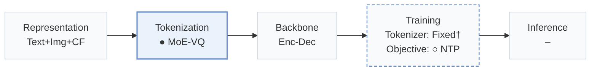
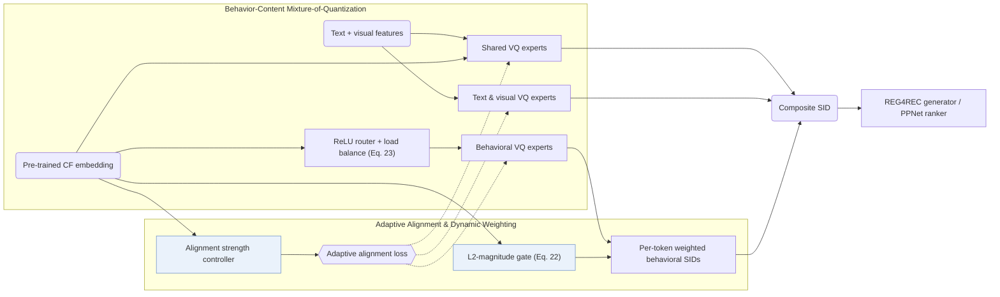
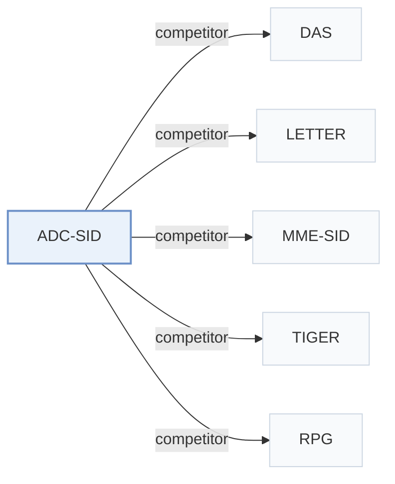

# ADC-SID

[← Problem × Stage Matrix](../../README.md#i--tokenization) · [Papers by Stage](../index/stages.md) · [Papers by Modality](../index/modality.md) · [Papers by Domain](../index/domain.md) · English | [中文](../zh/papers/adc-sid.md)

| **Title** | *Taming the Long Tail: Denoising Collaborative Information for Robust Semantic ID Generation* |
| :-- | :-- |
| **Authors** | Xu et al. |
| **Venue** | arXiv’25 |
| **Problem × Stage** | `I. Informativeness` · `Tokenization` |
| **Changes** | ● Tokenization · ○ Objective |
| **SID inputs** | `Text` + `Img` + `CF` |
| **Domain** | `E-commerce` · `Ads` |
| **Links** | [Paper](https://arxiv.org/abs/2510.25622) |
| **Reading level** | Reading Notes (Level 2) |

**On this page**: [TL;DR](#tldr) · [At a Glance](#at-a-glance) · [1. Why It Matters](#1-why-this-paper-matters) · [2. Method](#2-how-it-works) · [3. Experiments](#3-experimental-findings) · [4. Limitations](#4-limitations--critical-analysis) · [5. Related Work](#5-connections-to-related-work)

```mermaid
flowchart LR
    R["Representation<br/>Text+Img+CF"] --> T["Tokenization<br/>● MoE-VQ"] --> B["Backbone<br/>Enc-Dec"] --> TR["Training<br/>Tokenizer: Fixed†<br/>Objective: ○ NTP"] --> I["Inference<br/>–"]
    classDef base fill:#f8fafc,stroke:#cbd5e1
    class R,T,B,TR,I base
    classDef other fill:#f8fafc,stroke:#6b8fc7,stroke-width:1.5px,stroke-dasharray:5 3
    class TR other
    classDef main fill:#eaf2fb,stroke:#6b8fc7,stroke-width:2px
    class T main
```

- `Text+Img+CF`: Text and image representations combined with collaborative signals.
- `MoE-VQ`: Mixture-of-experts vector quantization.
- `Enc-Dec`: Encoder-decoder.
- `Fixed†`: Tokenizer frozen before generator training (inferred).
- `NTP`: Next-token prediction loss only; continuing from a pretrained LLM (SFT) also counts as NTP.

### TL;DR

> [!NOTE]
> ADC-SID adds collaborative information to Semantic ID quantization with alignment strength that adapts to collaborative noise and learned weights for behavioral IDs, instead of uniform alignment and equal weights.

---

### At a Glance

| Aspect | Summary |
| :-- | :-- |
| Key Findings | On a 48,106,880-item industrial advertising dataset and Amazon Beauty, ADC-SID outperforms content-only (RQ-VAE, OPQ) and fixed-alignment (LETTER) baselines on R@100, N@100, and AUC, achieving its largest AUC gains on bottom-25% long-tail items and validating in a 5-day online A/B test (Sec. 4.2, Sec. 4.5, Sec. 5, Table 2, Table 5, Fig. 6). |
| Limitation | Behavioral token weights are computed from the L2 magnitude of a pre-trained collaborative embedding, tying weighting quality to that upstream model, while collision handling and inference latency are not reported (Sec. 3.4.1, Sec. 4.1.3). |

---

### 1. Why This Paper Matters

Semantic IDs (SIDs) quantize item content features so related items share discrete tokens, and collaborative tokenizers inject user-item interaction signals into those codes (Abstract). Because user-item interactions follow a skewed power-law distribution, collaborative embeddings for long-tail items are sparse and noisy: uniform alignment corrupts tail content representations, while equal token weighting treats noisy and informative behavioral SIDs alike. ADC-SID regulates alignment strength per item and learns per-token behavioral weights.

> "unlike relatively uniform content features, user-item interactions are highly skewed, resulting in a significant quality gap in collaborative information between popular and long-tail items." (Abstract)

---

### 2. How It Works

```mermaid
flowchart LR
    subgraph MoEVQ["Behavior-Content Mixture-of-Quantization"]
        Txt("Text + visual features") --> ShExp["Shared VQ experts"]
        Beh("Pre-trained CF embedding") --> ShExp
        Txt --> ContExp["Text & visual VQ experts"]
        Beh --> Router["ReLU router + load balance (Eq. 23)"]
        Router --> BehExp["Behavioral VQ experts"]
    end
    subgraph Denoise["Adaptive Alignment & Dynamic Weighting"]
        Beh --> Ctrl["Alignment strength controller"]:::key
        Ctrl --> LAlign{{"Adaptive alignment loss"}}
        LAlign -.-> ShExp
        LAlign -.-> ContExp
        LAlign -.-> BehExp
        Beh --> Gate["L2-magnitude gate (Eq. 22)"]:::key
        BehExp --> WSum["Per-token weighted behavioral SIDs"]
        Gate --> WSum
    end
    ShExp --> OutSID("Composite SID")
    ContExp --> OutSID
    WSum --> OutSID
    OutSID --> Down["REG4REC generator / PPNet ranker"]
    classDef key fill:#eaf2fb,stroke:#6b8fc7
```

#### Behavior-Content Mixture-of-Quantization

ADC-SID separates quantization into shared experts that capture patterns common to behavior and content, and modality-specific experts dedicated to textual, visual, and behavioral inputs (Sec. 3.2).

#### Adaptive Behavior-Content Alignment

Instead of enforcing uniform cross-view pull across the catalog, an alignment strength controller modulates behavior-content alignment strength according to item popularity so sparse behavioral signals do not overwrite long-tail content representations (Sec. 3.3.1).

> "To adaptively align behavior and content information for head and long-tail items, the alignment strength controller is proposed to calculate the alignment strength." (Sec. 3.3.1)

#### Dynamic Behavioral Weighting

A gating network computes an importance weight for each behavioral SID token from the L2 magnitude of the item's pre-trained collaborative embedding (Sec. 3.4.1, Eq. 22). Inside the behavioral branch, a ReLU-based router paired with a load-balancing loss mitigates expert collapse and uneven token assignment (Sec. 3.4.2, Eq. 23).

> "This gate suppresses noisy behavioral SIDs, improving the robustness of behavioral SIDs when incorporated with downstream recommendations." (Sec. 3.4.1)

---

### 3. Experimental Findings

Experimental setup

- **Datasets**: Industrial: Southeast Asian e-commerce advertising platform, October 2024 to May 2025, about 30 million users and 40 million ads (Table 1: 35,154,135 users, 48,106,880 items), average sequence length 128; filtering rules not reported. Public: Amazon Product Reviews Beauty (May 1996-September 2014); generative retrieval uses 5-core filtering of users and items, 22,363 users and 12,101 items; ranking uses the rating data with ratings above 3 as positives.
  - Source: Industrial data: [S4.SS1.SSS1.p2](https://arxiv.org/html/2510.25622v3#S4.SS1.SSS1.p2); Beauty filtering and sequence construction: [S4.SS1.SSS1.p3](https://arxiv.org/html/2510.25622v3#S4.SS1.SSS1.p3); sizes: [S4.T1](https://arxiv.org/html/2510.25622v3#S4.T1).
- **Split**: Beauty generative retrieval: chronological sequences capped at 20 items; the train/validation/test allocation is not reported. Beauty ranking: chronological 90%/10% train/test split. Industrial offline split: not reported. Online: 5-day A/B test with 10% random user traffic.
  - Source: Beauty ranking split and retrieval sequence construction: [S4.SS1.SSS1.p3](https://arxiv.org/html/2510.25622v3#S4.SS1.SSS1.p3); online test: [S5.p1](https://arxiv.org/html/2510.25622v3#S5.p1).
- **Candidates**: not reported (full catalog versus sampled evaluation candidates); retrieval uses Recall and NDCG at N=50 and 100.
  - Source: Retrieval metrics only: [S4.SS1.SSS2.p3](https://arxiv.org/html/2510.25622v3#S4.SS1.SSS2.p3).
- **Visibility**: warm; no unseen-item protocol is defined. The long-tail analysis stratifies items by 30-day impression counts (top 25% versus bottom 25%).
  - Source: No cold-start protocol; the popularity analysis groups items by 30-day impressions: [S4.SS5.p1](https://arxiv.org/html/2510.25622v3#S4.SS5.p1).
- **SID**: Industrial: SID length 10 with codebook size printed as "3,00" (shared 2, text 2, visual 2, behavioral 4 codes for ADC-SID). Public: SID length 6 with codebook size 100 (shared 1, text 1, visual 1, behavioral 3). The online system uses an 8-token SID. Collision handling: not reported.
  - Source: Codebook settings: [S4.SS1.SSS3.p3](https://arxiv.org/html/2510.25622v3#S4.SS1.SSS3.p3); online SID length: [S5.p1](https://arxiv.org/html/2510.25622v3#S5.p1); no collision rule found in Sections 3-5.
- **Inference budget**: Generative retrieval uses the REG4REC encoder-decoder; ranking uses PPNet. Beam width, hardware, inference batch size, and latency: not reported.
  - Source: Downstream backbones only: [S4.SS1.SSS3.p2](https://arxiv.org/html/2510.25622v3#S4.SS1.SSS3.p2).
- **Results from**: Table 2 (generative retrieval and discriminative ranking on industrial data and Beauty, with quantization metrics); Table 3 (industrial ablation); Table 4 and Figure 5 (hyperparameters); Figure 6 (popular versus long-tail AUC); Table 5 (5-day online A/B test).
  - Source: Main table: [S4.T2](https://arxiv.org/html/2510.25622v3#S4.T2); ablation: [S4.T3](https://arxiv.org/html/2510.25622v3#S4.T3); hyperparameters: [S4.T4](https://arxiv.org/html/2510.25622v3#S4.T4); popularity: [S4.F6](https://arxiv.org/html/2510.25622v3#S4.F6); online: [S5.T5](https://arxiv.org/html/2510.25622v3#S5.T5).

- Main retrieval and ranking comparison: across the Southeast Asian e-commerce advertising dataset (35,154,135 users, 48,106,880 ads) and Amazon Beauty (22,363 users, 12,101 items), behavior-content aligned SIDs (RQ-Kmeans, LETTER) beat content-only SIDs (RQ-VAE, OPQ) on generative retrieval (R@50, R@100, N@50, N@100 with REG4REC) and discriminative ranking (AUC with PPNet), and ADC-SID ranks highest overall (Abstract, Sec. 4.1, Sec. 4.2, Table 1, Table 2).
- Component ablations: industrial ablations verify the contributions of the shared-specific MoE-VQ architecture, adaptive alignment controller, and learned behavioral weights against equal weighting (Sec. 4.3.2, Table 3).
- Popularity stratification: grouping items into popular (top 25%) and long-tail (bottom 25%) buckets by 30-day impression counts shows that ADC-SID delivers its largest AUC improvements on tail items without degrading head items (Sec. 4.5, Fig. 6).
- Online A/B test: a 5-day online A/B test serving 10% of random advertising traffic with an 8-token SID confirms production gains over the platform baseline (Sec. 5, Table 5).

---

### 4. Limitations & Critical Analysis

**Our analysis.**

- Because the behavioral gate relies on the L2 norm of an external collaborative embedding, miscalibrated norms in the upstream CF model can distort behavioral token weights (Sec. 3.4.1).
- The paper does not report a collision-resolution mechanism, and the industrial codebook size is printed with a typographical error in Sec. 4.1.3.
- MME-SID combines text, visual, and collaborative inputs via `MM-RQ` tokenization for a `Dec-Only` model with discriminative `Scoring`; ADC-SID tokenizes the same three modalities through `MoE-VQ` experts and evaluates them in an `Enc-Dec` generator (`REG4REC`) as well as `PPNet`.

---

### 5. Connections to Related Work

```mermaid
flowchart LR
    P["ADC-SID"]
    P -->|"competitor"| A["DAS"]
    P -->|"competitor"| B["LETTER"]
    P -->|"competitor"| C["MME-SID"]
    P -->|"competitor"| D["TIGER"]
    P -->|"competitor"| E["RPG"]
    classDef main fill:#eaf2fb,stroke:#6b8fc7,stroke-width:2px
    classDef peer fill:#f8fafc,stroke:#cbd5e1
    class P main
    class A,B,C,D,E peer
```

- **Competitor** · [DAS](das.md): DAS aligns SIDs with collaborative signals by multi-view contrastive learning; ADC-SID adds adaptive alignment strength and dynamic weighting to denoise behavior signals for long-tail items.
  - Source: ADC-SID v3, Section 4.1.2 baselines: [S4.I3.i4.p1](https://arxiv.org/html/2510.25622v3#S4.I3.i4.p1); Table 2: [S4.T2](https://arxiv.org/html/2510.25622v3#S4.T2).
- **Competitor** · [LETTER](letter.md): LETTER fuses semantic and collaborative signals in one RQ-VAE tokenizer with fixed regularization; ADC-SID uses mixture-of-quantization experts with popularity-aware alignment.
  - Source: ADC-SID v3, Section 4.1.2 baselines: [S4.I3.i5.p1](https://arxiv.org/html/2510.25622v3#S4.I3.i5.p1); Table 2: [S4.T2](https://arxiv.org/html/2510.25622v3#S4.T2).
- **Competitor** · [MME-SID](mme-sid.md): MM-RQ-VAE produces separate collaborative, textual, and visual SIDs with contrastive alignment; ADC-SID adds shared and specific experts and a learned per-token weighting of behavioral SIDs.
  - Source: ADC-SID v3, Section 4.1.2 baselines: [S4.I3.i6.p1](https://arxiv.org/html/2510.25622v3#S4.I3.i6.p1); Table 2: [S4.T2](https://arxiv.org/html/2510.25622v3#S4.T2).
- **Competitor** · [TIGER](tiger.md): The RQ-VAE baseline is attributed to TIGER's content-only semantic IDs; ADC-SID injects denoised collaborative information.
  - Source: ADC-SID v3, Section 4.1.2 describes the RQ-VAE baseline as TIGER: [S4.I3.i1.p1](https://arxiv.org/html/2510.25622v3#S4.I3.i1.p1); Table 2 row RQ-VAE: [S4.T2](https://arxiv.org/html/2510.25622v3#S4.T2).
- **Competitor** · [RPG](rpg.md): The OPQ baseline is attributed to RPG's unordered content codes; ADC-SID builds hierarchical behavior-content codes instead.
  - Source: ADC-SID v3, Section 4.1.2 describes the OPQ baseline as RPG: [S4.I3.i2.p1](https://arxiv.org/html/2510.25622v3#S4.I3.i2.p1); Table 2 row OPQ: [S4.T2](https://arxiv.org/html/2510.25622v3#S4.T2).

[View all papers in this cell](../../README.md#i--tokenization)
