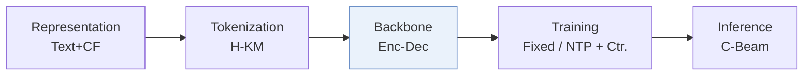
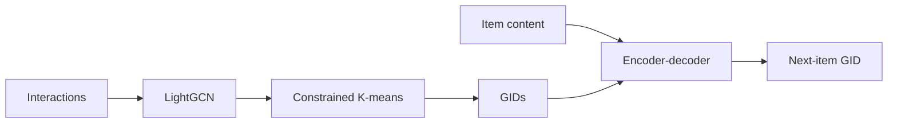
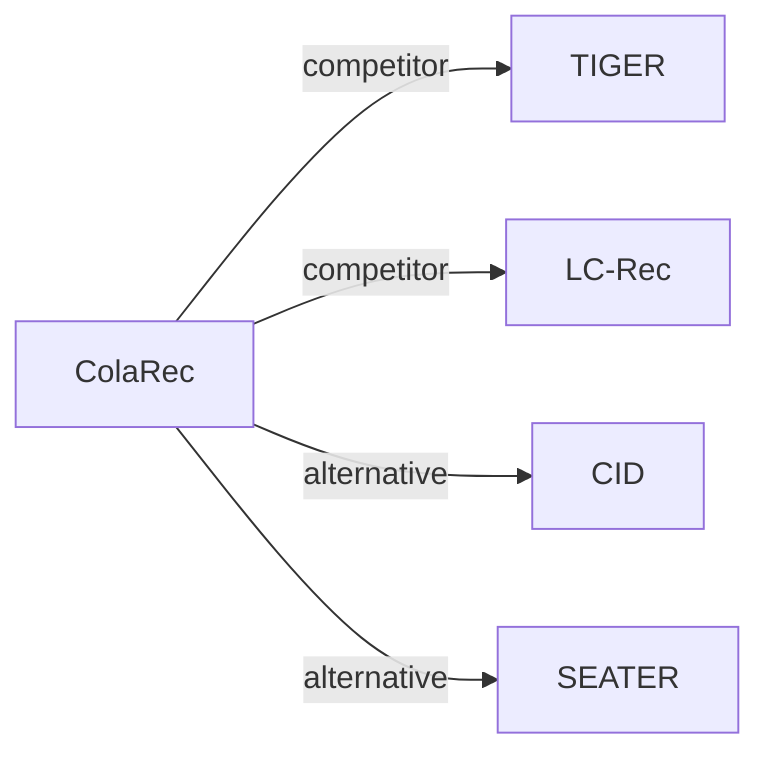

# ColaRec

*Content-based collaborative generation for recommender systems* — Wang et al. · CIKM’24

`I. Informativeness` · `Backbone` · [Paper](https://arxiv.org/abs/2403.18480) · [Code](https://github.com/Junewang0614/ColaRec) · [Matrix](../../README.md#i--backbone) · [中文](../zh/papers/colarec.md)

Reading level: Reading Notes (Level 2) · On this page: [TL;DR](#tldr) · [At a Glance](#at-a-glance) · [1. Why It Matters](#1-why-this-paper-matters) · [2. Method](#2-how-it-works) · [3. Experiments](#3-experimental-findings) · [4. Limitations](#4-limitations--critical-analysis) · [5. Related Work](#5-connections-to-related-work)

```mermaid
flowchart LR
    R["Representation<br/>Text+CF"] --> T["Tokenization<br/>H-KM"] --> B["Backbone<br/>Enc-Dec"] --> TR["Training<br/>Fixed / NTP + Ctr."] --> I["Inference<br/>C-Beam"]
    classDef main fill:#eaf2fb,stroke:#6b8fc7
    class B main
```

- `H-KM`: Hierarchical k-means.
- `Enc-Dec`: Encoder-decoder.
- `Fixed`: SIDs are built first and not changed while the generator trains.
- `NTP + Ctr.`: NTP plus a contrastive loss.
- `C-Beam`: Constrained beam search.

### TL;DR

> [!NOTE]
> ColaRec builds generative identifiers from a pretrained collaborative filtering model and generates them from interacted-item content, with an item indexing task and a contrastive loss aligning both spaces.

### At a Glance

| Aspect | Summary |
| :-- | :-- |
| Research Problem | I. Informativeness: Do the SIDs, or the model reading them, carry the collaborative and multimodal signals recommendation needs? |
| Key Contribution | ColaRec builds generative identifiers from a pretrained collaborative filtering model and generates them from interacted-item content, with an item indexing task and a contrastive loss aligning both spaces. |
| Modified Stage | Backbone |
| Limitation | The generative identifiers (GIDs) come from offline LightGCN embeddings and clustering, so items without interactions have no collaborative representation to cluster (Sec. 4.2). |

### 1. Why This Paper Matters

Existing LLM-based methods fuse content and collaborative signals but rely on textual language generation, which the authors state is not fully aligned with recommendation (Abstract). ColaRec instead decodes item identifiers with a sequence-to-sequence model tailored to recommendation (Abstract).

> "To model collaborative signals, the GIDs are constructed from a pretrained collaborative filtering model, and the user is represented as the content aggregation of interacted items." (Abstract)

Based on arXiv v2.

### 2. How It Works

```mermaid
flowchart LR
    A[Interactions] --> B[LightGCN]
    B --> C[Constrained K-means]
    C --> D[GIDs]
    E[Item content] --> F[Encoder-decoder]
    D --> F
    F --> G[Next-item GID]
```

#### Generative Identifier Construction

ColaRec applies constrained K-means hierarchically to item representations from a pretrained LightGCN model (Sec. 4.2).

> "Specifically, we first extract item representations from a pretrained LightGCN model. Then the constrained K-means algorithm is called hierarchically based on the item representations." (Sec. 4.2)

#### Item Indexing Task

The indexing task maps an item's text, together with the users who interacted with it, to the item's GID (Sec. 4.4, Eq. 7). It shares the encoder-decoder with the recommendation task (Sec. 4.4).

#### Training Objective

The recommendation loss, the indexing loss, a BPR loss with one sampled negative, and a weighted contrastive loss are trained jointly (Sec. 4.5, Eq. 11).

> "The idea is that items with similar GIDs should also be similar in the content-based semantic space." (Sec. 4.5)

#### Inference

Constrained beam search limits each token to those valid under the prefix (Sec. 4.5).

### 3. Experimental Findings

Experimental setup

- **Datasets**: Amazon Product Reviews: Beauty, Sports and Outdoors, Cell Phones and Accessories (Phone); Food.com Recipe. Users and items with fewer than 5 interactions are filtered. Sizes (users / items / interactions): Beauty 22,363 / 12,101 / 198,502; Sports 35,598 / 18,357 / 296,337; Phone 27,879 / 10,429 / 194,439; Recipe 17,813 / 41,240 / 555,618.
  - Source: Datasets and 5-interaction filter: [S5.SS1.p1](https://arxiv.org/html/2403.18480v2#S5.SS1.p1); statistics: [S4.T1](https://arxiv.org/html/2403.18480v2#S4.T1).
- **Split**: General recommendation, not sequential: each user's interactions are randomly split 8:1:1 into training, validation, and test. Three runs are averaged.
  - Source: Random 8:1:1 per-user split for general (non-sequential) recommendation: [S5.SS2.p1](https://arxiv.org/html/2403.18480v2#S5.SS2.p1).
- **Candidates**: full catalog
  - Source: Candidate set is the whole item set: [S5.SS2.p1](https://arxiv.org/html/2403.18480v2#S5.SS2.p1).
- **Visibility**: warm; no unseen-item protocol is defined.
  - Source: Random interaction split with no cold-start experiment: [S5.SS2.p1](https://arxiv.org/html/2403.18480v2#S5.SS2.p1); long-tail users are analyzed separately: [S5.T3](https://arxiv.org/html/2403.18480v2#S5.T3).
- **SID**: GID length l=3 from hierarchical constrained K-means over pretrained LightGCN item embeddings, K=32 clusters per level (48 for Recipe). Collisions are avoided by construction: clusters hold at most K^(l-t) items and leaf positions are assigned randomly, so each item has a unique GID.
  - Source: Constrained hierarchical K-means over LightGCN embeddings, random leaf assignment, one unique GID per item: [S4.SS2.p1](https://arxiv.org/html/2403.18480v2#S4.SS2.p1) and [S4.SS2.p2](https://arxiv.org/html/2403.18480v2#S4.SS2.p2); l=3, K=32 (Recipe 48): [S5.SS4.p1](https://arxiv.org/html/2403.18480v2#S5.SS4.p1).
- **Inference budget**: Constrained beam search over valid GID prefixes; numerical beam width not reported. T5-small backbone. Recall and NDCG at n=5 and 10 (Table 2). Hardware, inference batch size, and latency: not reported.
  - Source: Constrained beam search: [S4.SS5.p5](https://arxiv.org/html/2403.18480v2#S4.SS5.p5); no numerical width found in Section 5.
- **Results from**: Table 2 (four datasets; mean of three runs); Table 3 (long-tail users); Table 4 (multi-task ablation and GID types); Figures 4-5 (GID length and cluster number).
  - Source: Main: [S4.T2](https://arxiv.org/html/2403.18480v2#S4.T2); long-tail users: [S5.T3](https://arxiv.org/html/2403.18480v2#S5.T3); ablation and GID types: [S5.T4](https://arxiv.org/html/2403.18480v2#S5.T4); GID length and K: [S5.SS7.SSS2.p1](https://arxiv.org/html/2403.18480v2#S5.SS7.SSS2.p1) and [S5.SS7.SSS2.p2](https://arxiv.org/html/2403.18480v2#S5.SS7.SSS2.p2).

- Main comparison: ColaRec reports better performance than the baselines on four benchmark datasets (Abstract, Table 2).
- Ablation: Table 4 removes the textual content, the indexing task, the BPR loss, or the contrastive loss, and replaces the GIDs with three other identifier types (Table 4).

### 4. Limitations & Critical Analysis

**Our analysis.**

- The contrastive loss pulls content representations toward the GID structure. This suggests that content similarity is reshaped by collaborative clusters, which may hurt items whose clusters are noisy.
- SEATER also uses tree-structured identifiers (`Tree-Clus.`) from `CF` input; ColaRec adds item content to the input (`Text+CF`).

### 5. Connections to Related Work

```mermaid
flowchart LR
    P["ColaRec"]
    P -->|competitor| A["TIGER"]
    P -->|competitor| B["LC-Rec"]
    P -->|alternative| C["CID"]
    P -->|alternative| D["SEATER"]
```

- **Competitor** · [TIGER](tiger.md): TIGER builds content-only RQ-VAE identifiers; ColaRec builds collaborative GIDs from LightGCN embeddings and aligns them with item content through item-item indexing.
  - Source: ColaRec v2, Section 5.3 baselines: https://arxiv.org/html/2403.18480v2#S5.SS3.p1 and https://arxiv.org/html/2403.18480v2#S5.I2.i8.p1 (adapted without sequential order); Table 2: https://arxiv.org/html/2403.18480v2#S4.T2.
- **Competitor** · [LC-Rec](lc-rec.md): LC-Rec learns TIGER-style indices and aligns an LLM through language tasks; ColaRec uses a T5-small generator with collaborative GIDs and a contrastive ranking loss.
  - Source: ColaRec v2, Section 5.3 baselines: https://arxiv.org/html/2403.18480v2#S5.I2.i9.p1; Table 2: https://arxiv.org/html/2403.18480v2#S4.T2.
- **Alternative** · [CID](cid.md): P5-CID builds collaborative IDs for prompt-based P5 models that rank a candidate list in the prompt; ColaRec generates GIDs over the whole item set.
  - Source: ColaRec v2, Section 5.3 explains why P5-based methods including Hua et al. (2023) are excluded as baselines: https://arxiv.org/html/2403.18480v2#S5.SS3.p2; related work: https://arxiv.org/html/2403.18480v2#S2.SS2.p3.
- **Alternative** · [SEATER](seater.md): SEATER also builds tree-structured identifiers for generative recommendation; ColaRec derives its tree from collaborative LightGCN embeddings and adds content-based item-item indexing.
  - Source: ColaRec v2, Section 1 and Section 2.2 cite SEATER among generative identifier methods: https://arxiv.org/html/2403.18480v2#S1.p3 and https://arxiv.org/html/2403.18480v2#S2.SS2.p3; not a baseline in Table 2.

[View all papers in this cell](../../README.md#i--backbone)
